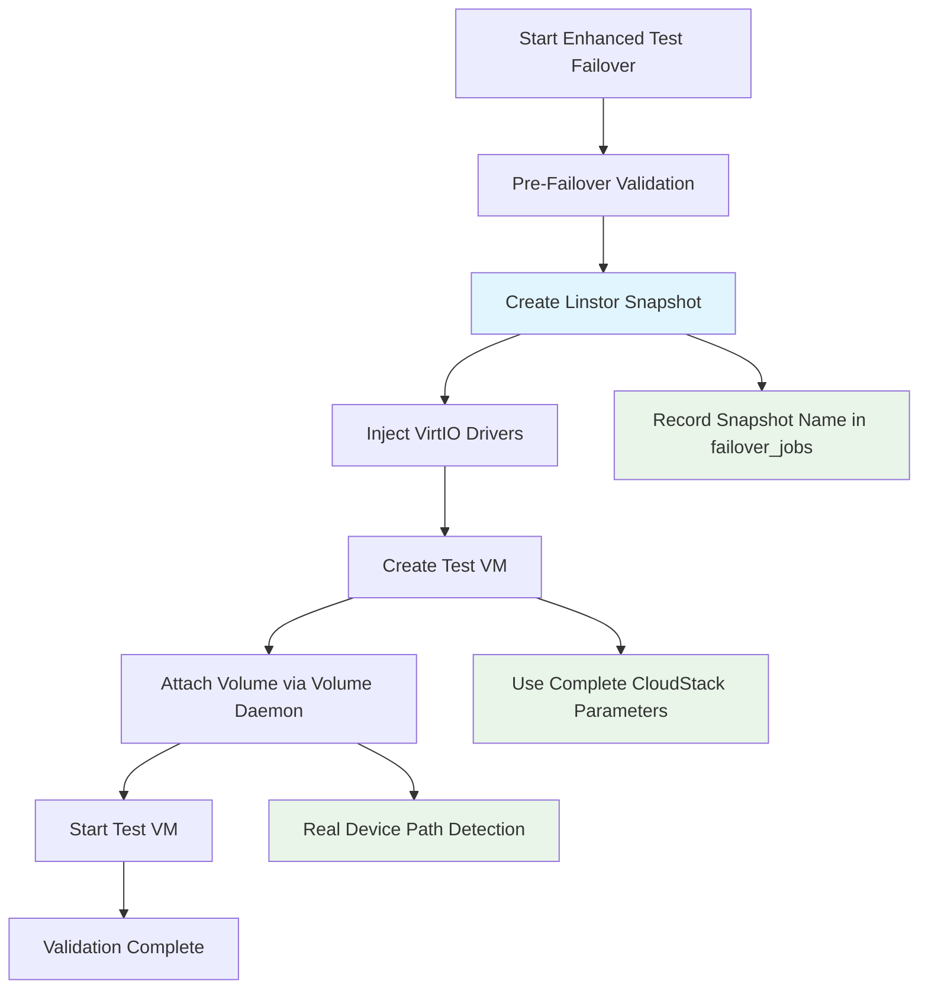

# MigrateKit OSSEA Failover System

## 🎯 **CURRENT SYSTEM (September 2025)**

MigrateKit OSSEA uses the **Enhanced Failover System** as the only supported failover implementation. This system provides comprehensive VM failover capabilities with complete audit trails, emergency recovery, and production-ready reliability.

> **⚠️ CRITICAL**: Original failover implementations have been deprecated and removed. Only the Enhanced Failover System is supported.

## 🏗️ **SYSTEM ARCHITECTURE**

```
┌─────────────────────────────────────────────────────────────┐
│                  Enhanced Failover System                  │
│                      (PRODUCTION)                          │
├─────────────────────────────────────────────────────────────┤
│  ┌─────────────────┐  ┌──────────────────┐  ┌─────────────┐ │
│  │ Enhanced Test   │  │ Enhanced Live    │  │ Enhanced    │ │
│  │ Failover Engine │  │ Failover Engine  │  │ Cleanup     │ │
│  └─────────────────┘  └──────────────────┘  └─────────────┘ │
├─────────────────────────────────────────────────────────────┤
│  ┌─────────────────┐  ┌──────────────────┐  ┌─────────────┐ │
│  │ Centralized     │  │ Volume Daemon    │  │ Linstor     │ │
│  │ Logging System  │  │ Integration      │  │ Snapshots   │ │
│  └─────────────────┘  └──────────────────┘  └─────────────┘ │
├─────────────────────────────────────────────────────────────┤
│  ┌─────────────────┐  ┌──────────────────┐  ┌─────────────┐ │
│  │ failover_jobs   │  │ job_tracking     │  │ Emergency   │ │
│  │ Database        │  │ Audit Trail      │  │ Recovery    │ │
│  └─────────────────┘  └──────────────────┘  └─────────────┘ │
└─────────────────────────────────────────────────────────────┘
```

## 🔄 **ENHANCED TEST FAILOVER WORKFLOW**

### **Complete 6-Step Process**



### **Key Features**

1. **🔒 Snapshot Protection**: Linstor snapshots enable complete rollback
2. **🔧 VirtIO Integration**: Windows VM compatibility for KVM
3. **📊 Complete Audit**: All operations tracked in database
4. **🚨 Emergency Recovery**: Snapshot names recorded for emergency rollback
5. **⚡ Volume Daemon**: Centralized volume management
6. **📝 Centralized Logging**: Structured logging with correlation IDs

## 💾 **DATABASE INTEGRATION**

### **Critical Tables**

#### **failover_jobs** (Primary tracking)
```sql
CREATE TABLE failover_jobs (
    job_id VARCHAR(191) UNIQUE NOT NULL,
    vm_id VARCHAR(191) NOT NULL,
    job_type VARCHAR(50) NOT NULL,        -- 'test' or 'live'
    status VARCHAR(50) DEFAULT 'pending',
    linstor_snapshot_name VARCHAR(191),   -- ⭐ CRITICAL for rollback
    destination_vm_id VARCHAR(191),       -- Created VM ID
    source_vm_spec TEXT,                  -- JSON VM specifications
    created_at TIMESTAMP,
    completed_at TIMESTAMP
);
```

#### **job_tracking** (Detailed audit)
```sql
CREATE TABLE job_tracking (
    id VARCHAR(36) PRIMARY KEY,
    parent_job_id VARCHAR(36),
    operation VARCHAR(100) NOT NULL,
    status ENUM('pending', 'executing', 'completed', 'failed', 'cancelled'),
    metadata JSON,
    error_message TEXT,
    created_at TIMESTAMP
);
```

## 🚀 **API ENDPOINTS**

### **Production Endpoints**

| Endpoint | Method | Purpose |
|----------|--------|---------|
| `/api/v1/failover/test` | POST | Enhanced test failover |
| `/api/v1/failover/live` | POST | Enhanced live failover |
| `/api/v1/failover/jobs` | GET | List failover jobs |
| `/api/v1/failover/jobs/{id}` | GET | Get job details |

### **Example Usage**

```bash
# Test Failover
curl -X POST http://localhost:8082/api/v1/failover/test \
  -H "Content-Type: application/json" \
  -d '{
    "vm_id": "420570c7-f61f-a930-77c5-1e876786cb3c",
    "vm_name": "pgtest1",
    "test_duration": "30m"
  }'
```

## 🛡️ **EMERGENCY RECOVERY**

### **Complete Recovery Process**

1. **Find Snapshot Name**:
   ```sql
   SELECT linstor_snapshot_name FROM failover_jobs 
   WHERE vm_id = '<vm-id>' 
   ORDER BY created_at DESC LIMIT 1;
   ```

2. **Detach Volume**:
   ```bash
   curl -X POST http://localhost:8090/api/v1/volumes/<volume-id>/detach
   ```

3. **Rollback Snapshot**:
   ```bash
   python3 /opt/migratekit/linstor/snapshot_client.py rollback <volume-uuid> <snapshot-name>
   ```

4. **Reattach to OMA**:
   ```bash
   curl -X POST http://localhost:8090/api/v1/volumes/<volume-id>/attach \
     -d '{"vm_id": "<oma-vm-id>"}'
   ```

## 📊 **MONITORING & VALIDATION**

### **Success Criteria**

- ✅ failover_jobs record created with all metadata
- ✅ Linstor snapshot created and name recorded
- ✅ VirtIO injection completed (Windows VMs)
- ✅ Test VM created with proper CloudStack configuration
- ✅ Volume attachment successful via Volume Daemon
- ✅ Test VM boots and is accessible

### **Monitoring Queries**

```sql
-- Current failover status
SELECT job_id, vm_id, status, linstor_snapshot_name 
FROM failover_jobs 
WHERE created_at > NOW() - INTERVAL 1 DAY
ORDER BY created_at DESC;

-- Detailed job tracking
SELECT operation, status, error_message 
FROM job_tracking 
WHERE metadata LIKE '%vm-id%' 
ORDER BY created_at DESC LIMIT 10;
```

## 🔧 **TECHNICAL COMPONENTS**

### **Source Files (CURRENT)**

| File | Purpose |
|------|---------|
| `enhanced_test_failover.go` | Test failover orchestration |
| `enhanced_live_failover.go` | Live failover orchestration |
| `enhanced_failover_wrapper.go` | API endpoints and logging |
| `enhanced_cleanup_service.go` | Cleanup and rollback |
| `validator.go` | Pre-failover validation |

### **Integration Points**

- **Volume Daemon**: `http://localhost:8090` - All volume operations
- **Linstor API**: `http://10.245.241.101:3370` - Snapshot operations
- **CloudStack API**: `http://10.245.241.101:8080` - VM operations
- **Centralized Logging**: Structured logging with correlation IDs

## 📈 **VERSION HISTORY**

### **v2.4.10 (CURRENT PRODUCTION)** ✅
- **Date**: September 3, 2025
- **Features**: Complete enhanced failover system
- **Fixes**: All critical issues resolved
- **Status**: Production ready

### **Deprecated Versions** ❌
- Original `test_failover.go` - Removed
- Original `live_failover.go` - Removed
- All pre-v2.4.9 versions - Archived

## 📚 **DOCUMENTATION**

### **Complete Guides**
- [Enhanced Failover Complete Guide](./failover/ENHANCED_FAILOVER_COMPLETE_GUIDE.md)
- [Enhanced Failover API Reference](./api/ENHANCED_FAILOVER_API.md)
- [Emergency Recovery Procedures](./failover/EMERGENCY_RECOVERY.md)

### **Archived Documentation**
- Deprecated systems archived in `/archive/deprecated-failover-2025-09-03/`

---

**This system represents the definitive MigrateKit OSSEA failover implementation as of September 2025.**
