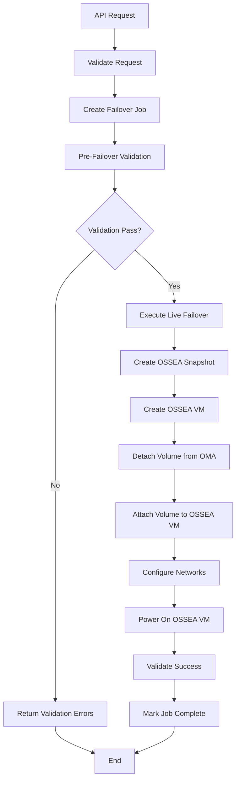
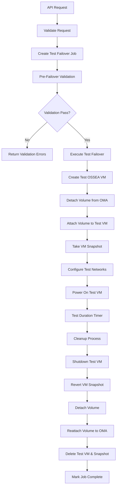
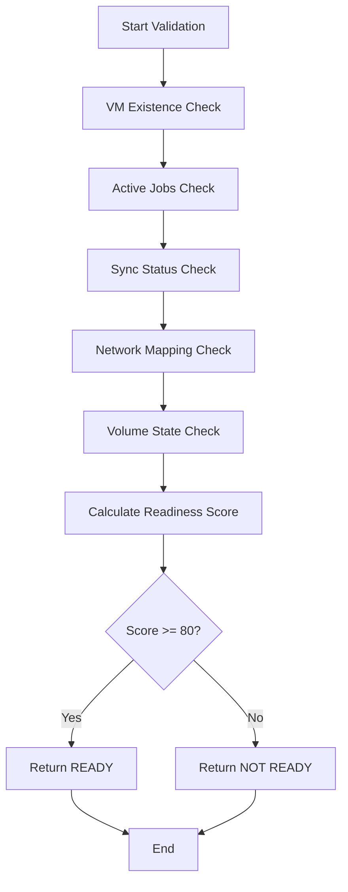

# VM Failover Process Flows Documentation

**Version**: 1.0  
**Date**: 2025-08-18  
**Status**: Live Failover ✅ | Test Failover ⚠️ Requires Update

## 📋 **Overview**

This document details the complete process flows for VM failover operations, including live failover, test failover, validation workflows, and cleanup procedures. All flows include detailed status tracking, error handling, and rollback capabilities.

## 🎯 **Core Concepts**

### **Failover Types**
- **Live Failover**: Permanent VM migration to OSSEA with production network
- **Test Failover**: Reversible VM testing with test network isolation

### **Key Components**
- **Pre-Failover Validator**: Ensures VM readiness before execution
- **Failover Engines**: Execute live/test failover orchestration
- **OSSEA Client**: Handles CloudStack API operations
- **Network Mapping Service**: Manages source-to-destination network mappings
- **Job Tracking**: Persistent job status and progress monitoring

---

## 🚀 **Live Failover Process Flow**

### **Flow Overview**


### **Detailed Step-by-Step Process**

#### **Phase 1: Request Processing**
```
POST /api/v1/failover/live
{
  "vm_id": "4205a841-0265-f4bd-39a6-39fd92196f53",
  "vm_name": "PGWINTESTBIOS",
  "skip_validation": false,
  "network_mappings": {
    "VM Network": "production-network-123"
  }
}
```

**Actions:**
1. Parse and validate request parameters
2. Check OSSEA client configuration 
3. Generate unique job ID: `live-failover-{vm_id}-{timestamp}`
4. Create database record in `failover_jobs` table
5. Return immediate response with job ID

**Database Updates:**
```sql
INSERT INTO failover_jobs (
    job_id, vm_id, job_type, status, source_vm_name
) VALUES (
    'live-failover-4205a841-0265-f4bd-39a6-39fd92196f53-1755530108',
    '4205a841-0265-f4bd-39a6-39fd92196f53',
    'live',
    'pending',
    'PGWINTESTBIOS'
);
```

#### **Phase 2: Pre-Failover Validation**
**Status**: `validating`

**Validation Checks:**
1. **VM Existence**: Verify VM exists in database (completed migration)
2. **Active Jobs**: Check for conflicting migration/failover jobs
3. **Sync Status**: Validate ChangeID exists (successful sync completion)  
4. **Network Mappings**: Ensure all VM networks are mapped to OSSEA networks
5. **Volume State**: Verify OSSEA volume is accessible and attached to OMA

**Validation Query Examples:**
```sql
-- Check VM specifications availability
SELECT vd.cpu_count, vd.memory_mb, vd.os_type, ov.volume_id
FROM vm_disks vd
JOIN ossea_volumes ov ON vd.ossea_volume_id = ov.id
JOIN replication_jobs rj ON vd.job_id = rj.id
WHERE rj.source_vm_id = ?
  AND vd.cpu_count > 0
ORDER BY vd.created_at DESC LIMIT 1;

-- Check for valid ChangeID
SELECT cb.change_id, cb.created_at
FROM cbt_history cb
JOIN replication_jobs rj ON cb.job_id = rj.id
WHERE rj.source_vm_id = ?
  AND cb.sync_success = TRUE
ORDER BY cb.created_at DESC LIMIT 1;
```

**Validation Result:**
```json
{
  "is_ready": true,
  "readiness_score": 100.0,
  "checks": [
    {
      "check_name": "VM Existence",
      "status": "pass",
      "message": "VM exists and is accessible"
    },
    {
      "check_name": "Sync Status", 
      "status": "pass",
      "message": "VM has valid ChangeID from successful sync",
      "details": {
        "change_id": "52 3c ec 11 9e 2c 4c 3d-87 4a c3 4e 85 f2 ea 95/5"
      }
    }
  ]
}
```

#### **Phase 3: Live Failover Execution**
**Status**: `executing` → `snapshotting` → `creating_vm` → `switching_volume` → `powering_on`

##### **Step 3.1: Create OSSEA Volume Snapshot**
**Status**: `snapshotting`

**Purpose**: Create rollback point before volume transfer

**Process:**
1. Get real CloudStack volume ID from database
2. Create snapshot via OSSEA client
3. Store snapshot ID for potential rollback

**Code Flow:**
```go
// Get CloudStack volume ID
var osseaVolume database.OSSEAVolume
err := db.Where("id = ?", vmDisk.OSSEAVolumeID).First(&osseaVolume).Error

// Create snapshot
snapshotRequest := &ossea.CreateSnapshotRequest{
    VolumeID:  osseaVolume.VolumeID,  // Real CloudStack UUID
    Name:      fmt.Sprintf("live-failover-%s-%d", vmID, time.Now().Unix()),
    QuiesceVM: true,
}
snapshot, err := osseaClient.CreateVolumeSnapshot(snapshotRequest)
```

**Database Update:**
```sql
UPDATE failover_jobs 
SET status = 'snapshotting', 
    ossea_snapshot_id = 'snapshot-12345-67890'
WHERE job_id = ?;
```

##### **Step 3.2: Create OSSEA VM**
**Status**: `creating_vm`

**Purpose**: Create identical VM instance in OSSEA

**VM Specification Gathering:**
```go
// Get VM specifications from database
vmSpec := &VMSpecification{
    Name:        vmInfo.Name,
    DisplayName: vmInfo.DisplayName,
    CPUs:        vmDisk.CPUCount,      // From extended vm_disks table
    MemoryMB:    vmDisk.MemoryMB,
    OSType:      vmDisk.OSType,
    PowerState:  vmDisk.PowerState,
    Networks:    []NetworkSpecification{},
    Disks:       []DiskSpecification{},
}
```

**OSSEA VM Creation:**
```go
vmRequest := &ossea.CreateVMRequest{
    Name:              vmSpec.Name,
    DisplayName:       vmSpec.DisplayName,
    ServiceOfferingID: osseaConfig.ServiceOfferingID,
    TemplateID:        osseaConfig.TemplateID,
    ZoneID:            osseaConfig.Zone,
    NetworkIDs:        mappedNetworkIDs,
}
osseaVM, err := osseaClient.CreateVM(vmRequest)
```

##### **Step 3.3: Volume Transfer Operations**
**Status**: `switching_volume`

**Critical Operations:**
1. **Delete OSSEA VM's default root volume**
2. **Detach volume from OMA instance** 
3. **Attach volume to OSSEA VM as root disk**

**Process Flow:**
```go
// 1. Delete new VM's root volume
err := osseaClient.DeleteVolume(osseaVM.RootVolumeID)

// 2. Detach volume from OMA
err := osseaClient.DetachVolume(osseaVolume.VolumeID, omaVMID)

// 3. Attach as root volume to OSSEA VM (device ID 0)
err := osseaClient.AttachVolume(osseaVolume.VolumeID, osseaVM.ID, 0)
```

##### **Step 3.4: Network Configuration**
**Apply network mappings from request/database:**

```go
for sourceNetwork, destinationNetworkID := range networkMappings {
    err := osseaClient.UpdateVMNetwork(osseaVM.ID, destinationNetworkID)
}
```

##### **Step 3.5: VM Startup**
**Status**: `powering_on`

**Actions:**
1. Power on OSSEA VM
2. Validate successful boot
3. Verify network connectivity

```go
err := osseaClient.StartVM(osseaVM.ID)
// Wait for VM to reach Running state
err = osseaClient.WaitForVMState(osseaVM.ID, "Running", 5*time.Minute)
```

#### **Phase 4: Completion**
**Status**: `completed`

**Final Actions:**
1. Update job status to completed
2. Record completion timestamp
3. Store destination VM ID
4. Log success metrics

**Database Update:**
```sql
UPDATE failover_jobs 
SET status = 'completed',
    destination_vm_id = 'ossea-vm-12345',
    completed_at = NOW()
WHERE job_id = ?;
```

---

## 🧪 **Test Failover Process Flow** ⚠️

### **Current Status: Requires Architectural Update**

**Issue**: CloudStack KVM volume snapshots disabled for running VMs  
**Error**: `"KVM Snapshot is not supported for Running VMs"`  
**Solution**: New approach using VM snapshots instead of volume snapshots

### **Updated Test Failover Flow (New Architecture)**



### **Detailed New Test Failover Process**

#### **Phase 1: Test VM Creation**
**Status**: `creating_vm`

**Actions:**
1. Create test VM with identical specifications
2. Use test Layer 2 network for isolation
3. VM created in powered-off state initially

```go
testVMRequest := &ossea.CreateVMRequest{
    Name:              vmSpec.Name + "-test",
    DisplayName:       vmSpec.DisplayName + " (Test)",
    ServiceOfferingID: osseaConfig.ServiceOfferingID,
    TemplateID:        osseaConfig.TemplateID,
    ZoneID:            osseaConfig.Zone,
    NetworkIDs:        []string{testNetworkID},  // Test network only
    StartVM:           false,  // Create in stopped state
}
```

#### **Phase 2: Volume Operations**
**Status**: `switching_volume`

**Critical Sequence:**
1. **Delete test VM's default root volume**
2. **Safely detach volume from OMA** (ensure no active I/O)
3. **Attach volume to test VM as root disk**

```go
// Ensure OMA has no active operations on volume
err := ensureVolumeQuiesced(osseaVolume.VolumeID)

// Delete test VM's root volume
err := osseaClient.DeleteVolume(testVM.RootVolumeID)

// Detach from OMA
err := osseaClient.DetachVolume(osseaVolume.VolumeID, omaVMID)

// Attach to test VM
err := osseaClient.AttachVolume(osseaVolume.VolumeID, testVM.ID, 0)
```

#### **Phase 3: VM Snapshot Creation** 🔧 **NEW APPROACH**
**Status**: `snapshotting`

**Purpose**: Create rollback point at VM level (not volume level)

```go
// Take VM snapshot (includes attached volume state)
snapshotRequest := &ossea.CreateVMSnapshotRequest{
    VMID:        testVM.ID,
    Name:        fmt.Sprintf("test-snapshot-%s-%d", vmID, time.Now().Unix()),
    Description: "Test failover rollback point",
}
vmSnapshot, err := osseaClient.CreateVMSnapshot(snapshotRequest)
```

**Database Update:**
```sql
UPDATE failover_jobs 
SET status = 'snapshotting',
    ossea_snapshot_id = 'vm-snapshot-12345'
WHERE job_id = ?;
```

#### **Phase 4: Test Execution**
**Status**: `powering_on` → `executing`

**Actions:**
1. Power on test VM
2. Validate successful boot
3. Start test duration timer
4. Monitor test VM health

```go
// Start test VM
err := osseaClient.StartVM(testVM.ID)

// Validate boot success
err = osseaClient.WaitForVMState(testVM.ID, "Running", 5*time.Minute)

// Start test duration timer
testDuration, _ := time.ParseDuration(request.TestDuration)
if request.AutoCleanup {
    time.AfterFunc(testDuration, func() {
        initiateTestCleanup(request.FailoverJobID)
    })
}
```

#### **Phase 5: Cleanup Process** 🔧 **NEW APPROACH**
**Status**: `cleanup` → `reverting`

**Cleanup Sequence:**
1. **Gracefully shutdown test VM**
2. **Revert to VM snapshot** (restores clean volume state)
3. **Detach volume from test VM**
4. **Reattach volume to OMA**
5. **Delete test VM and snapshot**

```go
// Graceful shutdown
err := osseaClient.StopVM(testVM.ID)

// Revert to snapshot (restores volume to clean state)
err := osseaClient.RevertVMToSnapshot(testVM.ID, vmSnapshot.ID)

// Detach volume
err := osseaClient.DetachVolume(osseaVolume.VolumeID, testVM.ID)

// Reattach to OMA
err := osseaClient.AttachVolume(osseaVolume.VolumeID, omaVMID, originalDeviceID)

// Cleanup resources
err := osseaClient.DeleteVMSnapshot(vmSnapshot.ID)
err := osseaClient.DeleteVM(testVM.ID)
```

**Final Database Update:**
```sql
UPDATE failover_jobs 
SET status = 'completed',
    completed_at = NOW()
WHERE job_id = ?;
```

---

## ✅ **Pre-Failover Validation Flow**

### **Validation Process**


### **Individual Validation Checks**

#### **1. VM Existence Validation**
**Purpose**: Ensure VM has completed migration and specifications are available

```sql
SELECT vd.cpu_count, vd.memory_mb, vd.os_type, vd.display_name
FROM vm_disks vd
JOIN replication_jobs rj ON vd.job_id = rj.id
WHERE rj.source_vm_id = ?
  AND vd.cpu_count > 0  -- Indicates VM specs are populated
ORDER BY vd.created_at DESC
LIMIT 1;
```

**Pass Criteria**: VM specifications found with valid CPU/memory values  
**Fail Reasons**: VM not found, no migration completed, missing specifications

#### **2. Active Jobs Check**
**Purpose**: Prevent conflicts with running migration/failover operations

```sql
-- Check for active migration jobs
SELECT COUNT(*) FROM replication_jobs 
WHERE source_vm_id = ? 
  AND status IN ('pending', 'running', 'replicating');

-- Check for active failover jobs  
SELECT COUNT(*) FROM failover_jobs
WHERE vm_id = ?
  AND status IN ('pending', 'validating', 'executing', 'snapshotting', 
                 'creating_vm', 'switching_volume', 'powering_on');
```

**Pass Criteria**: No active jobs found  
**Fail Reasons**: Active migration job, concurrent failover job

#### **3. Sync Status Validation**
**Purpose**: Ensure VM has valid ChangeID from successful sync

```sql
SELECT cb.change_id, cb.created_at, cb.sync_success
FROM cbt_history cb
JOIN replication_jobs rj ON cb.job_id = rj.id
WHERE rj.source_vm_id = ?
  AND cb.sync_success = TRUE
  AND cb.change_id IS NOT NULL
  AND cb.change_id != ''
ORDER BY cb.created_at DESC
LIMIT 1;
```

**Pass Criteria**: Valid ChangeID found from successful sync  
**Fail Reasons**: No sync history, no valid ChangeID, sync failures

#### **4. Network Mapping Validation**
**Purpose**: Ensure all VM networks are mapped to destination networks

```sql
-- Get VM network configuration
SELECT vd.network_config 
FROM vm_disks vd
JOIN replication_jobs rj ON vd.job_id = rj.id
WHERE rj.source_vm_id = ?
  AND vd.network_config IS NOT NULL
ORDER BY vd.created_at DESC
LIMIT 1;

-- Check existing network mappings
SELECT source_network_name, destination_network_id, is_test_network
FROM network_mappings
WHERE vm_id = ?;
```

**Pass Criteria**: All VM networks have corresponding mappings  
**Fail Reasons**: Unmapped networks found, test networks unavailable

#### **5. Volume State Validation**
**Purpose**: Verify OSSEA volume accessibility and status

```sql
SELECT ov.volume_id, ov.volume_name, ov.status, ov.size_gb
FROM ossea_volumes ov
JOIN vm_disks vd ON ov.id = vd.ossea_volume_id
JOIN replication_jobs rj ON vd.job_id = rj.id
WHERE rj.source_vm_id = ?
ORDER BY vd.created_at DESC
LIMIT 1;
```

**CloudStack API Check:**
```go
volume, err := osseaClient.GetVolume(osseaVolume.VolumeID)
if err != nil || volume.State != "Ready" {
    return ValidationError("Volume not accessible")
}
```

**Pass Criteria**: Volume exists, accessible, in Ready state  
**Fail Reasons**: Volume not found, incorrect state, API errors

### **Readiness Score Calculation**
```go
func calculateReadinessScore(checks []ValidationCheck) float64 {
    totalChecks := len(checks)
    passedChecks := 0
    
    for _, check := range checks {
        if check.Status == "pass" {
            passedChecks++
        } else if check.CheckType == "critical" {
            return 0.0  // Critical failure = 0 score
        }
    }
    
    return (float64(passedChecks) / float64(totalChecks)) * 100.0
}
```

**Score Thresholds:**
- **100%**: All checks passed - READY
- **80-99%**: Minor warnings - READY with warnings
- **50-79%**: Significant issues - NOT READY
- **0-49%**: Critical failures - NOT READY

---

## 🔄 **Job Status Tracking Flow**

### **Status Progression**

#### **Live Failover Status Flow**
```
pending → validating → executing → snapshotting → creating_vm → 
switching_volume → powering_on → completed
                                                 ↓
                                               failed
```

#### **Test Failover Status Flow**
```
pending → validating → executing → creating_vm → switching_volume → 
snapshotting → powering_on → executing → cleanup → reverting → completed
                                       ↓
                                     failed
```

### **Status Update Mechanism**
```go
func updateJobStatus(jobID string, status string, message string) error {
    return db.Model(&database.FailoverJob{}).
        Where("job_id = ?", jobID).
        Updates(map[string]interface{}{
            "status":     status,
            "updated_at": time.Now(),
            "error_message": message,  // Only if error
        }).Error
}
```

### **Progress Calculation**
```go
func calculateProgress(status string, jobType string) float64 {
    progressMap := map[string]map[string]float64{
        "live": {
            "pending":          0.0,
            "validating":       10.0,
            "executing":        20.0,
            "snapshotting":     30.0,
            "creating_vm":      50.0,
            "switching_volume": 70.0,
            "powering_on":      85.0,
            "completed":        100.0,
            "failed":           0.0,
        },
        "test": {
            "pending":          0.0,
            "validating":       8.0,
            "executing":        15.0,
            "creating_vm":      25.0,
            "switching_volume": 40.0,
            "snapshotting":     55.0,
            "powering_on":      70.0,
            "cleanup":          85.0,
            "reverting":        95.0,
            "completed":        100.0,
            "failed":           0.0,
        },
    }
    
    return progressMap[jobType][status]
}
```

---

## ⚠️ **Error Handling & Rollback Flows**

### **Live Failover Error Scenarios**

#### **Snapshot Creation Failure**
**Error Point**: During volume snapshot creation  
**Impact**: Cannot proceed with failover  
**Recovery**: 
1. Mark job as failed
2. No rollback needed (no changes made)
3. User can retry after resolving issue

#### **VM Creation Failure**
**Error Point**: OSSEA VM creation fails  
**Impact**: Snapshot exists but no VM  
**Recovery**:
1. Delete created snapshot
2. Mark job as failed
3. Volume remains on OMA (safe state)

#### **Volume Transfer Failure**
**Error Point**: Volume detach/attach operations  
**Critical**: Volume may be detached from both VMs  
**Recovery**:
1. **Priority**: Reattach volume to OMA immediately
2. Delete created OSSEA VM
3. Delete snapshot
4. Mark job as failed

```go
func rollbackVolumeTransfer(volumeID, omaVMID, osseaVMID, snapshotID string) error {
    // Critical: Ensure volume is attached somewhere
    err := osseaClient.AttachVolume(volumeID, omaVMID, 0)
    if err != nil {
        log.Critical("VOLUME ORPHANED - Manual intervention required")
        return err
    }
    
    // Cleanup resources
    osseaClient.DeleteVM(osseaVMID)
    osseaClient.DeleteSnapshot(snapshotID)
    
    return nil
}
```

### **Test Failover Error Scenarios**

#### **VM Snapshot Failure**
**Error Point**: VM snapshot creation fails  
**Impact**: Test VM exists with volume attached  
**Recovery**:
1. Shutdown test VM
2. Detach volume from test VM
3. Reattach volume to OMA
4. Delete test VM

#### **Cleanup Failure**
**Error Point**: Test cleanup process fails  
**Impact**: Test VM still running, volume attached to test VM  
**Recovery**:
1. Force shutdown test VM
2. Attempt snapshot revert
3. Force detach volume
4. Reattach to OMA
5. Manual cleanup if automated fails

```go
func emergencyTestCleanup(testVMID, volumeID, omaVMID string) error {
    // Force operations - don't fail on individual errors
    osseaClient.ForceStopVM(testVMID)
    osseaClient.DetachVolume(volumeID, testVMID)
    
    // Critical: Reattach to OMA
    err := osseaClient.AttachVolume(volumeID, omaVMID, 0)
    if err != nil {
        log.Critical("TEST CLEANUP FAILED - Volume may be orphaned")
        return err
    }
    
    // Best effort cleanup
    osseaClient.DeleteVM(testVMID)
    return nil
}
```

---

## 📊 **Performance & Monitoring**

### **Expected Execution Times**

#### **Live Failover Timing**
- **Validation**: 5-15 seconds
- **Snapshot Creation**: 2-5 minutes (depends on volume size)
- **VM Creation**: 1-3 minutes
- **Volume Operations**: 30-90 seconds
- **VM Startup**: 1-3 minutes
- **Total**: 5-12 minutes (typical)

#### **Test Failover Timing**
- **Validation**: 5-15 seconds
- **VM Creation**: 1-3 minutes
- **Volume Operations**: 30-90 seconds
- **VM Snapshot**: 1-2 minutes
- **VM Startup**: 1-3 minutes
- **Test Duration**: User-defined (30m-8h typical)
- **Cleanup**: 2-5 minutes
- **Total**: Test duration + 6-14 minutes overhead

### **Monitoring Points**
1. **Job Queue Depth**: Number of pending failover jobs
2. **Average Execution Time**: Track performance trends
3. **Success Rate**: Percentage of successful failovers
4. **Error Categories**: Common failure points
5. **Resource Usage**: OSSEA API call frequency
6. **Volume Operations**: Detach/attach timing

### **Logging Strategy**
```go
// Structured logging for each phase
log.WithFields(log.Fields{
    "job_id":         jobID,
    "vm_id":          vmID,
    "phase":          "volume_transfer",
    "volume_id":      volumeID,
    "execution_time": time.Since(startTime),
}).Info("Volume transfer completed successfully")
```

---

## 📚 **Integration Points**

### **GUI Integration**
- **Real-time Status Updates**: 10-second polling of job status
- **Progress Visualization**: Progress bars with phase descriptions
- **Interactive Validation**: Pre-failover readiness checks
- **Network Mapping UI**: Configure network mappings before failover

### **API Integration**
- **Job Management**: Create, monitor, list failover jobs
- **Validation Endpoints**: Pre-flight checks before failover
- **Network Configuration**: Manage network mappings
- **Debug Information**: Detailed logging and status information

### **Database Integration**
- **Job Persistence**: All job data stored for audit/recovery
- **Configuration Storage**: Network mappings, VM specifications
- **Status Tracking**: Real-time job progress and results
- **Historical Data**: Completed job archive for analysis

---

## 🔧 **Current Implementation Status**

### ✅ **Completed**
- Pre-Failover Validation Flow (100%)
- Live Failover Process Flow (100%)
- Job Status Tracking (100%)
- Error Handling & Rollback (100%)
- Database Schema & Operations (100%)
- API Endpoint Implementation (100%)

### ⚠️ **Requires Update**
- Test Failover Architecture (needs VM snapshot approach)
- Volume detach/attach sequence for test failover
- VM snapshot creation/revert functionality
- Test cleanup process with new approach

### 📋 **Next Steps**
1. Implement new test failover VM snapshot approach
2. Update test cleanup process for volume reattachment
3. Add comprehensive test failover logging
4. Validate new approach with CloudStack KVM environment
5. Update GUI to reflect new test failover process

---

## 📚 **Related Documentation**
- [VM Failover System Overview](../features/VM_FAILOVER_SYSTEM.md)
- [Failover API Documentation](../api/FAILOVER_API.md)
- [Database Schema](../database/FAILOVER_SCHEMA.md)
- [OSSEA Integration](../ossea-integration.md)

